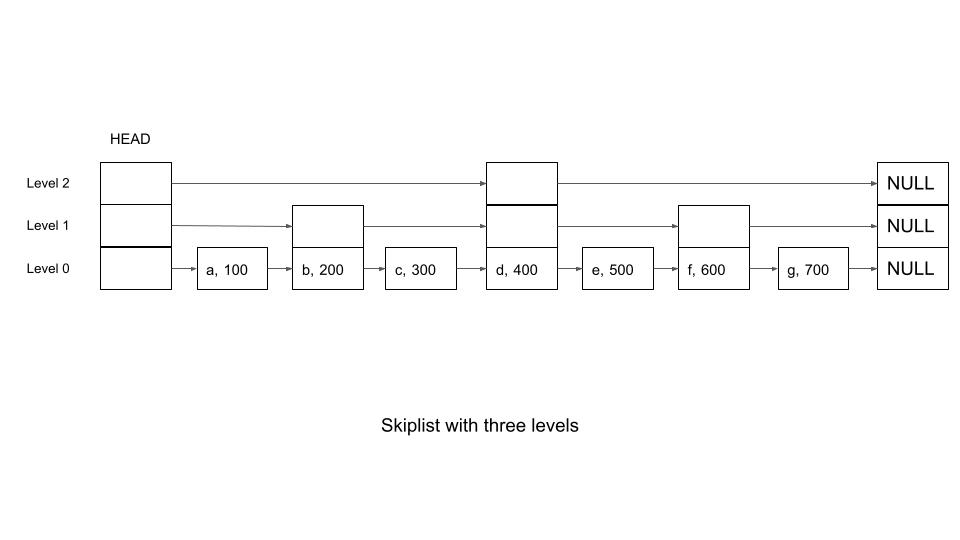
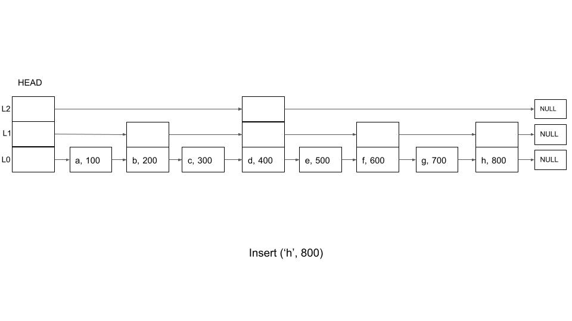
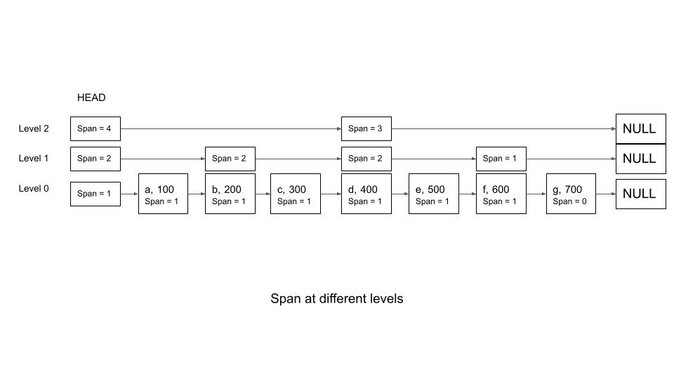
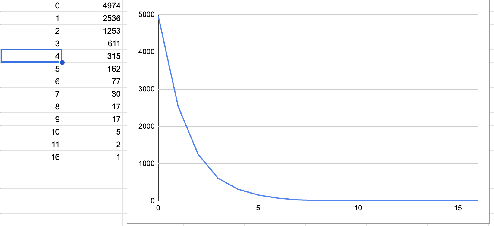

# Redis Sorted Sets - Under the Hood

## Introduction
[Redis Sorted Set](https://redis.io/docs/data-types/sorted-sets/) is a handy data structure to use when you want to implement leaderboards and rate limiters -- especially when you want to do them in real time. It lets you add elements with their scores (For example, user id with the game scores) and allows you to fetch not only the score, but also their ranks. Search, inserts, deletes and rank operations are O(lg(n)), on an average.

[This video](https://www.youtube.com/watch?v=MUKlxdBQZ7g) gives a good overview of the data structure and typical use cases.

## Implementation
While there are many articles that explain the need for the sorted set and its usage, there is not much information on the actual implementation. This [article](https://scalegrid.io/blog/introduction-to-redis-data-structures-sorted-sets/) has a small section on the internals and pointer to the actual [source code][Source code], but does not get into the details.

In this article, I will share snippets of [Python code][Python code], which is a simplified adaption of the original redis source code. This code was written with an intention to understand the underlying data structures and the actual implementation. To that effect, the Python code is neither complete nor thorough (missing hanlding corner cases etc). Please refer to the original [redis source code][source code] for the full-fledged implementation.

## Core Data Structures
At the heart of redis sorted set are two datastructures
* A hash map, that stores the member as the key and the score as the value
* A skip list that maintains the members ordered by score for easy search

The hash map is straight forward and does not warrant much discussion. It just provides a O(1) look up, if we just need to look up the score for the member.

## Skiplist
The Skiplist is the interesting data structure. SkipLists are <mark>probabilistic search structures</mark> that lets you do search, insert and delete in <mark>O(lg(N))</mark> time (not guaranteed, but higly likely). 

 The [Open DSA Book](https://opendsa-server.cs.vt.edu/ODSA/Books/CS3/html/SkipList.html#) explains the internal implementation of this data structure.

At the heart of it, a skiplist is a sorted linked list, but instead of just pointers to only the next node (which makes search O(N)), it has additional pointers to nodes further in the list. The key to the above is the sorted order -- the concept of skip lists work only because the elements are sorted. For the rest of the discussion, we use the term 'score' as that attribute of the elements that determine the sorting order.  

Simplistically, one can imagine a skip list to comprise multiple lanes, where the slowest lane (level 0) is the regular linked list where every element has a pointer to the next node. Elements in the faster lanes (levels 1 and above) have pointers to elements that are further way (skips a few elements in between, and hence the name skip list). For example, the second lane (level 1) could skip one element -- head has a pointer to the 2nd element, which in turn has the pointer to the fourth element and so on. So, there are n/2 elements in the second lane. Similarly, the third lane (level 2) connects evey fourth element and so there are n/4 elements and so on. If an element is present in a higher lane, it will also be present in all the slower lanes below it. So, element 4 will be in all three lanes, element 2 will be in the first two lanes and so on. This is depicted in the picture below.
<div class = "Skip List 1">
    
</div>

Now, let us see how this helps us to do search, insert and delete in O(log(N)).

### Search
---
To search for an element with a particular score, we start the search from the fastest lane, which lets us skip a lot of elements. While the next element is still lesser than the element to be searched, we continue. Otherwise, we slip down one level and try with that level and so on. Since level 0 has all elements, the search will definitely succeed (provided the element exists). In the above example, if we want to search for 'g' (with a score of 700), the following will be the steps:
* Start with the highest level (level 2). This leads to 'd'. 
* Because 'd' has a lesser score (400), we try to go further. However, there are no more elements in that lane, so we slip to level 1
* We travel one hop in level 1. This leads to 'f'. Since 'f'  has a lower score (600) than 'g', we try one more hop.
* However, there are no more elements in that lane, so we drop one more level.
* At level 0, we travel sequentially from 'f' till we reach 'g'

So, instead of 7 Hops, we can get to 'e' in 3 hops. We never visit elements 'a', 'b', 'c' and 'e'.

The following code snippet implements this logic.

```python
    def search(self, score):
        current = self.head
        for i in range(self.levels -1, -1, -1):
            #Print to verify that we are starting the lower level search from the correct node (and not from head)
            print("Searching at level %d, current score is %d" % (i, int(current.score)))
            while (current.get_next(i) is not None and 
                current.get_next(i).score <= score):
                if (current.get_next(i).score == score):
                    print("Found at level %d" % i)
                    return current.get_next(i)
                current = current.get_next(i)

        print("Score %d not Found" % score)
        return None 
```
### Inserts and Deletes 
---
Inserts and deletes also take O(log(N)) on average. We will explain insert here, delete follows a similar logic.

For inserts, we use a logic similar to search. The first step is to identify the maximum level for this node.  See the section on [determining the level](#determining-the-random-level). Once we have the maximum level, we identify the node after which we need to insert the given node, based on score (Similar to the search logic above). This has to be done for all levels, from 0 to maximum level. Once we have identified this node, it is just a matter of adjusting pointers for those lanes. The following code snippet demonstrates this logic. After the first for loop, <code>update[i]</code> will contain the node, for each level, that needs updation. The pointers are adjusted in the second loop.

```python
    current = self.head
    #Example code. Duplicates not handled
    for i in range(self.level -1, -1, -1):
        while (current.next[i] is not None and
                   current.next[i].score <= score):
            current = current.next[i]
        update[i] = current

    for i in range(0, max_level_for_node):
        to_insert_node.next[i] = update[i].next[i]
        update[i].next[i] = to_insert_node
```

Let us assume that we are inserting a new node 'h', with a score of 800. And let us assume that the maximum level for this node is 1. So, we will need to adjust pointers for the levels 0 and 1. In this example

<code>
update[0] = 'g'
update[1] = 'f'
</code>

<div class = "Skip List Ins">
    
</div>

Again, because of the skip pointers, this operation can be done in O(log(N)) complexity. 

### Calculating Rank
---
One of the most important use for the Redis sorted set is to calculate ranks. We are, in particular, interested in two questions:
* Given an element (and its score), what is the rank of this element?
* List all elements that are in a particular rank range. For example, what are the top 50 elements?

One naive way to think about this is to store the rank with the element, along with the score. However, this will need us to recalculate the rank for all elements during every insert/delete/update and will negate the O(log(N)) advantage. The current implementation of redis solves this by a nifty logic. Instead of storing the rank with the element, we can store a variable called 'span' which indicates the number of elements that we need to skip to get to the next valid element in the current lane. This span is stored at all levels for all the elements and the *head* node. 

For the skip list that we discussed in [the skip list section](#skiplist), the following are the values for the span, for different nodes. 
<div class = "Span Values">
    
</div>

The span value has to be adjusted every time a new node is inserted or deleted. Updates can just be thought of as a delete followed by an insert. This is done by making a small modification to the insert logic specified above. As we build the *update* array, we also build another array called *rank* that has the rank of the corresponding node in the *update* array. For example, <code>rank[i]</code> will have the rank of element in <code>update[i]</code>. Once we have these values, the spans for all affected nodes can be calculated easily from the span of the update nodes and the different rank values. Note here that rank[0] is essentially the rank of the element just before the inserted node. In the above insert example,

<code>
 update[0] = 'g', rank[0] = 7 
 update[1] = 'f', rank[1] = 6
</code>

The following is the modified logic in insert. 

```python
      current = self.head
        for i in range(self.level -1, -1, -1):
            rank[i] = 0 if (i == self.level -1) else rank[i + 1]
            while (current.next[i] is not None and
                   current.next[i].score <= score):
                rank[i] = rank[i] + current.span[i]
                current = current.next[i]
            update[i] = current

       for i in range(0, max_level_for_node):
            to_insert_node.next[i] = update[i].next[i]
            update[i].next[i] = to_insert_node

            to_insert_node.span[i] = update[i].span[i] - (rank[0] - rank[i])
            update[i].span[i] = rank[0] - rank[i] + 1
```

A little more has to be done for the inserts to work - like setting the span for the unaffected levels and initializing the spans when the maximum level changes. One can look at the actual details in the [redissource code](https://github.com/redis/redis/blob/unstable/src/t_zset.c) or [python code](https://github.com/jothipn/redissortedset/blob/main/skiplistrss.py).


Once the span variables are available, calculating the rank is straight forward. As we traverse through the skip list to identify our nodes, we just keep adding the spans for the visited nodes and that should just give us the rank of the interested element.

```python
   def get_rank(self, score, element, debug = False):
        rank = 0
        current = self.head
        for i in range(self.level -1, -1, -1):
            while (current.next[i] is not None and
                   current.next[i].score <= score):
                rank = rank + current.span[i]
                current = current.next[i]
                if (debug):
                    print("Adding span of %c at level %d with spanvalue %d, new rank %d" 
                           % (current.element, i, current.span[i], rank))
        return rank
```

In the example above, if we were to get the rank of element 'g', we will traverse through level 2 (span = 4), then level 1 (span = 2) and finally level 0 (span = 1), giving us a rank of 7 (4 + 2 +1)

Identifying the element with the given rank follows similar logic. We keep traversing the skip list and keep track of the ranks, like above. When we reach the desired rank, we just pull out the element.

```python
    def get_element_by_rank(self, rank):
        current = self.head
        currRank = 0

        for i in range(self.level -1, -1, -1):
            while (current.next[i] is not None and
                   currRank + current.span[i] <= rank):
                currRank = currRank + current.span[i]
                current = current.next[i]
            
            if (currRank == rank):
                return current
```

Finally, identifying the range is easily done using the above method. We just identify the node with the start rank. Then we just traverse the level 0 and pull out the remaining elements until the end rank. The complexity for this is O(log(N) + M), where M is the range length.

```python
    def get_range(self, start, end):
        assert(end - start <= self.length)
        assert(start > 0)
        assert(end <= self.length)

        range_length = end - start
        result_list = []

        node = self.get_element_by_rank(start)
        result_list.append(node)

        while (range_length > 0):
            node = node.next[0]
            result_list.append(node)
            range_length = range_length - 1
        
        return result_list
```

### Determining the random level 
---
One big assumption while obtaining the O(log(N)) complexity for the insert, delete and search operations is that the skip list is organized well such that each level has half the number of elements than the level below and that the elements are equally spaced. However, this is expensive to achieve. So, instead, we typically assign a random maximum level for a node during insertion. Typically, we use a geometric distribution where there is a 50% probability that a node has one pointer, 25 % for two and so on. In the picture below, x axis is the maximum level and y axis is the number of elements that have this value as the maximum level. 

[Open DSA Book](https://opendsa-server.cs.vt.edu/ODSA/Books/CS3/html/SkipList.html#) has this implementation

```java
  // Pick a level using a geometric distribution
  int randomLevel() {
    int lev;
    for (lev = 0; Math.abs(ran.nextInt()) % 2 == 0; lev++) { // ran is random generator
      ; // Do nothing
    }
    return lev;
  }
  ```
When I ran this code for 10000 times, I got a proper power curve. This indicates that the random assignment of levels is good enough for all practical purposes.

<div class = "Random Distribution">
    
</div>

The redis source uses a slightly different implementation

```c
/* Returns a random level for the new skiplist node we are going to create.
 * The return value of this function is between 1 and ZSKIPLIST_MAXLEVEL
 * (both inclusive), with a powerlaw-alike distribution where higher
 * levels are less likely to be returned. */
int zslRandomLevel(void) {
    static const int threshold = ZSKIPLIST_P*RAND_MAX;
    int level = 1;
    while (random() < threshold)
        level += 1;
    return (level<ZSKIPLIST_MAXLEVEL) ? level : ZSKIPLIST_MAXLEVEL;
}
```

## Summary

In this post, we looked at some of the internals of the redis sorted set data structure and what it does, under the hood, to maintain a sorted list with good average complexity for search, inserts and deletes. We also saw how the Redis team uses the *span* attribute to maintain and calculate ranks of the elements so that the leaderboard use cases are easily served.

[Source code]: https://github.com/redis/redis/blob/unstable/src/t_zset.c
[Python code]: https://github.com/jothipn/redissortedset